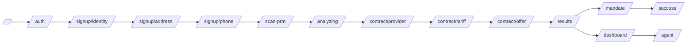
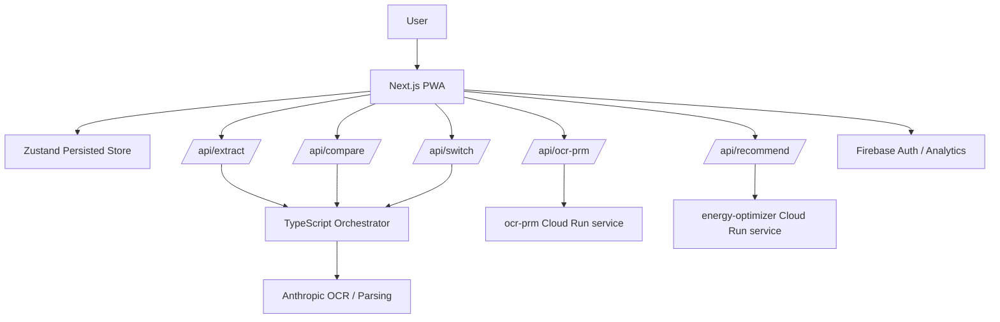
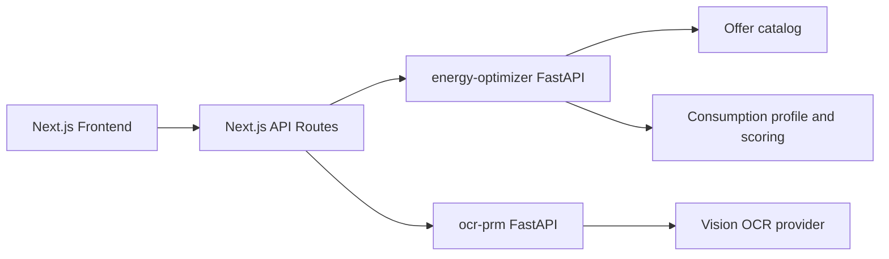

# Nova

<p align="center">
  
</p>

<p align="center">
  <strong>AI agent for electricity cost optimization</strong><br />
  Hackathon MVP built with <code>Next.js</code>, combining a PWA flow, bill OCR, offer comparison, and a simulated provider switch.
</p>

<p align="center">
  
</p>

## Table of Contents

- [Overview](#overview)
- [Problem Statement](#problem-statement)
- [What the Product Does](#what-the-product-does)
- [User Journey](#user-journey)
- [Architecture](#architecture)
- [Tech Stack](#tech-stack)
- [Repository Structure](#repository-structure)
- [Local Setup](#local-setup)
- [Environment Variables](#environment-variables)
- [API and Services](#api-and-services)
- [Deployment](#deployment)
- [Current MVP Status](#current-mvp-status)
- [Roadmap](#roadmap)

## Overview

Nova is a prototype product designed to help households understand whether they are overpaying for electricity and identify better plans in a fast, guided flow.

This repository includes:

- a `Next.js 15` front-end application written in `TypeScript`
- a mobile-first installable PWA experience
- an electricity offer comparison flow
- bill OCR through Anthropic
- Next.js API proxies for Python services deployable on Cloud Run
- a simulated provider-switch execution flow for demo purposes

The project was built for a high-clarity, high-reliability hackathon demo, while keeping the architecture reusable for a more production-oriented version later.

## Problem Statement

The French electricity market is difficult for most consumers to navigate:

- there are many offers and pricing structures are hard to compare
- switching providers is legally simple, but adoption remains low
- traditional comparison tools are usually one-off and weakly personalized
- most tools do not combine data ingestion, analysis, recommendation, and execution into a single product experience

Nova addresses that gap with an agent-style flow: understand the contract, compare the market, recommend an action, and simulate execution.

## What the Product Does

Main capabilities currently present in the repository:

- entry and authentication-related screens
- guided onboarding with mascot-driven UI and visible progress
- simulated Enedis-based energy profile retrieval
- bill OCR fallback to extract contract information
- PRM scanning through a dedicated OCR service
- offer comparison based on household profile and user preferences
- display of top-ranked offers and estimated savings
- mandate and switch simulation flow
- dashboard and agent-oriented views
- optional Firebase integration for auth and analytics
- pricing page with optional Stripe payment link

## User Journey

The route structure currently implemented in the codebase follows this general flow:



At a product level, the MVP supports two main ingestion paths:

1. a simulated Enedis / Linky path for fast, reliable demos
2. a bill import or PRM scan path to reconstruct or enrich the energy profile

## Architecture

### System View



### Logical Orchestration Layer

The repository contains a lightweight TypeScript agent layer in `src/lib/agents/`:

```text
orchestrator
|- onboarding.agent
|- watcher.agent
|- decision.agent
`- executor.agent
```

Responsibility split:

- `onboarding.agent`: contract and profile ingestion
- `watcher.agent`: offer loading, filtering, and ranking
- `decision.agent`: recommendation logic and decision framing
- `executor.agent`: execution / switch simulation
- `orchestrator`: end-to-end business flow composition

### Service Architecture



## Tech Stack

| Layer | Technologies |
|---|---|
| Front-end | Next.js 15, React 19, TypeScript |
| UI | Tailwind CSS 4, Radix-based components, internal utilities |
| State | Zustand with local persistence |
| AI / OCR | Anthropic SDK |
| Supporting back-end | FastAPI |
| Deployment | Google Cloud Run, Firebase Hosting / App Hosting depending on setup |
| Payments | Stripe Payment Link on the front-end |
| Analytics / Auth | Firebase |

## Repository Structure

```text
team_6/
|- public/
|  |- mascot/               # mascot illustrations and branded screens
|  |- logos/                # electricity provider logos
|  `- demo/                 # demo assets
|- services/
|  |- energy-optimizer/     # FastAPI recommendation service
|  `- ocr-prm/              # FastAPI PRM extraction service
|- src/
|  |- app/                  # Next.js App Router + API routes
|  |- components/           # UI and business components
|  |- lib/
|  |  |- agents/            # orchestration layer
|  |  |- anthropic/         # clients, prompts, parsing
|  |  |- calculations/      # cost and savings logic
|  |  |- persistence/       # persistence adapters
|  |  |- schemas/           # Zod validation
|  |  `- store/             # Zustand stores
|  `- data/                 # offer datasets
|- .env.example
|- firebase.json
`- README.md
```

## Local Setup

### Prerequisites

- `Node.js` 20+
- `npm`
- `Python` 3.12 for the FastAPI services

### Run the front-end

```bash
npm install
cp .env.example .env.local
npm run dev
```

The app will be available at `http://localhost:3000`.

### Run the Python services locally

Recommendation service:

```bash
cd services/energy-optimizer
pip install -r requirements.txt
uvicorn app:app --port 8080 --reload
```

PRM OCR service:

```bash
cd services/ocr-prm
pip install -r requirements.txt
uvicorn app:app --port 8081 --reload
```

### TypeScript verification

```bash
npm run typecheck
```

## Environment Variables

The baseline configuration is documented in `.env.example`.

### AI and analysis

| Variable | Purpose |
|---|---|
| `ANTHROPIC_API_KEY` | Anthropic API key |
| `ANTHROPIC_MODEL` | model used for OCR / extraction |
| `BILL_EXTRACTION_PROVIDER` | extraction provider selection |
| `DEMO_FALLBACK` | enables demo fallback behavior |
| `ENERGY_OPTIMIZER_URL` | recommendation service URL |

### Firebase

| Variable | Purpose |
|---|---|
| `NEXT_PUBLIC_FIREBASE_API_KEY` | Firebase config |
| `NEXT_PUBLIC_FIREBASE_AUTH_DOMAIN` | Firebase config |
| `NEXT_PUBLIC_FIREBASE_PROJECT_ID` | Firebase config |
| `NEXT_PUBLIC_FIREBASE_STORAGE_BUCKET` | Firebase config |
| `NEXT_PUBLIC_FIREBASE_MESSAGING_SENDER_ID` | Firebase config |
| `NEXT_PUBLIC_FIREBASE_APP_ID` | Firebase config |
| `NEXT_PUBLIC_FIREBASE_MEASUREMENT_ID` | Firebase analytics |

### Payments

| Variable | Purpose |
|---|---|
| `NEXT_PUBLIC_STRIPE_PAYMENT_LINK_URL` | premium subscription payment link |

## API and Services

### Next.js API Routes

| Route | Purpose |
|---|---|
| `POST /api/extract` | bill OCR extraction |
| `POST /api/ocr-prm` | proxy to the PRM OCR service |
| `POST /api/recommend` | proxy to the recommendation engine |
| `POST /api/compare` | offer comparison through the orchestrator |
| `POST /api/connect-enedis` | simulated Enedis connection / related ingestion |
| `POST /api/switch` | provider switch simulation |

### `energy-optimizer` service

Responsibilities:

- receives a consumption profile
- estimates annual cost across a catalog of offers
- ranks offers by potential savings
- returns recommendation-ready data for the application

### `ocr-prm` service

Responsibilities:

- receives an image of a bill or meter screen
- attempts to extract the 14-digit PRM
- returns the result with a confidence score

## Deployment

The repository is structured for a hybrid deployment model:

- Next.js front-end
- Python services on Google Cloud Run
- Firebase integrations for selected product capabilities

This is reflected in:

- `firebase.json`
- `.firebaserc`
- `apphosting.yaml`
- `services/*/Dockerfile`

A production-like deployment typically requires:

1. configuring secrets and environment variables
2. deploying `services/energy-optimizer`
3. deploying `services/ocr-prm`
4. pointing the Next.js API routes to the live services
5. building and deploying the front-end

## Current MVP Status

This README is intentionally aligned with the current repository state rather than an idealized product narrative.

Already implemented:

- coherent multi-step user journey
- persisted client-side state
- in-app bill OCR flow
- dedicated PRM OCR service
- offer comparison and top-offer presentation
- mascot-driven branding and onboarding visuals
- optional Firebase integration

Still prototype / demo-grade:

- some product steps rely on simulated flows
- provider switching remains simulated
- regulatory, contract, and security hardening are not yet production-ready
- some service endpoints may still be hardcoded in server routes

## Roadmap

Natural next steps:

- connect a production-grade Enedis consent flow
- improve OCR reliability across a broader bill dataset
- move all service configuration fully to environment variables
- store comparison history and decision traces
- add continuous monitoring and alerting logic
- harden auth, analytics, and payment infrastructure
- prepare a B2G / municipality-friendly operating mode

## Product Positioning

Nova is not intended as a static comparison page. The product direction is an optimization agent that:

- understands a household's current energy situation
- identifies better opportunities in the market
- explains the recommendation
- assists, and eventually automates, execution

That vision is already visible in this repository through the `agents` layer, the guided journey, and the separation between ingestion, analysis, decision, and execution.
